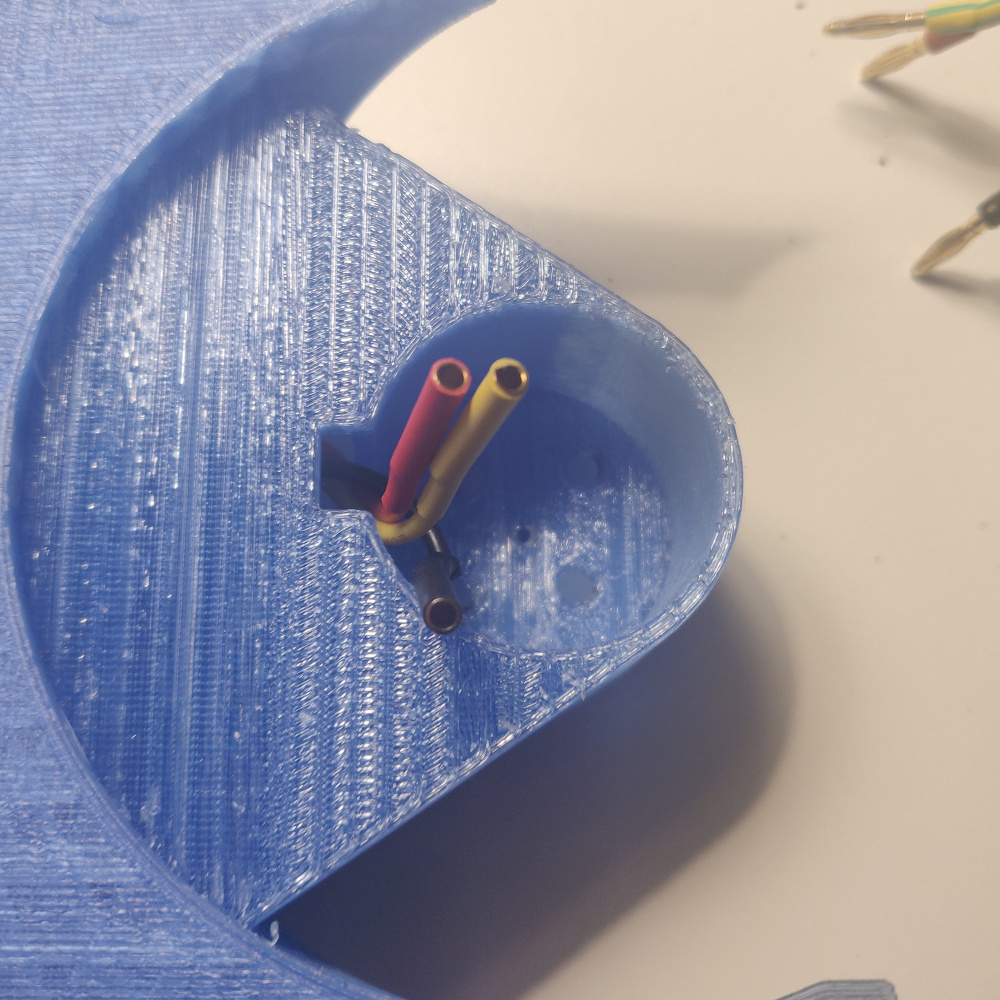

# Timmy build guide

Here you'll find a step by step guide to build Timmy. Actually, it's very short:
1. Get all of the components
2. Print the chassis
3. Solder electronics together (not detailed here, as it's a very generic step)
4. Program the transmitter

## Required components
* 2x Turnigy 15mm 75:1 motor
* 2x Brushed ESC
* Brushless motor
* Brushless ESC
* Saw blade
* Turnigy NanoTech 2S LiPo
* Turnigy i6 receiver
* 3x 2.5 x 16mm wood screws

## Required tools
These will be absolutely necessary:
* Soldering iron
* Precision screwdriver (with Torx bits)
* Pliers or spanner for M3 nuts

And these are not, but will help:
* Hand file
* Hot glue gun
* Plumber's wrench
* Instant glue (any cyanoacrylate, eg. Superglue)

## Printing
You will find all of the required STLs in the stl folder. 
If you want to modify the design, feel free to fork the 
[OnShape project](https://cad.onshape.com/documents/876aae336eb09ce6dbed248a/w/df23d79c1c15b5b48407cba3/e/a6816d4151a04fb3a5ee5f1b).

### Chassis
All parts can be printed either with PLA, ABS or PETG. Original Timmy was
printed with PETG. __Chassis__ and its cover should be printed with layer height
<= 0.35 mm. For chassis, use supports.

### Wheels
For best traction, you will need to attach some additional rubber using instant
glue. In that case, you can print wheels using any filament available. In case
you do not want to glue any rubber, printing wheels in TPU will help with
traction. In that case, use the alternative design dedicated for TPU printing.

In any case, best print at layer height 0.2 mm.

### Saw blade mounting
No supports, 0.2 mm layer height. TPU would be the best material, but with a
drop of instant glue anything will do just fine.

## Electronics
There is nothing out of ordinary here, only generic stuff. I'll add a link to 
some RC model electronics tutorial

## Assembly
### Weapon
Weapon assembly here is a bit of improvisation, feel free to disregard whatever
you read here and do it your way if you feel like it.

1.  Screw an M3 nut onto the motor shaft. At this point you may want to fix the
    stator in place, for example by clamping it with plumber's wrench:

    

2.  Fix the printed part that has an M3 shaped slot in it. The nut you just
    fixed should fit right in there.

    

3.  Put the blade on. No need to care about the rotation direction too much,
    you'll be able to configure it with the transmitter.

    

4.  Now you have two options: 1) you can use instant glue to lock the blade
    in place between two 3D printed plastic parts, 2) you can add a layer of rubber
    hoping the friction will keep the blade spinning.

    Second option also acts as a safety clutch - it will prevent you from stalling
    and burning the motor, but at the same time make the weapon less effective.

    

### Chassis
Not much to be said here, just cram the soldered electronics inside. There are
two slots for motors (orientation again does not really matter), and a slot for
a master switch. As much as it is optional, I encourage you to include one, it
makes operating the robot much easier. I have made one out of the switch that
was included with the brushed ESC.

Guide the brushless ESC cables through the opening in the weapon motor slot like
this:

Then, connect them to the motor. Put the motor in place and fix it with screws
that came with it.

When everything is in place, you may want to consider fixing it with
some hot glue (you should at least glue the master switch if you decided to
include it). Just be careful not to immobilize either the drive motor gearbox
or master switch moving part.

Now cram down all the rest. Don't worry too much if some cables stick out, they
will be squeezed by the top cover.

Put the top cover and screw it with 2.5mm wood screws. **Be careful with the one
over the weapon motor. Use a M3 nut to distance it from the cover so it does not
push against the motor.**

### Wheels
Glue some rubber around them. You can also use an old inner tube for a bike,
just cut it in about 8mm wide rings, stretch them and place and put them on.
They should hold nicely by themselves, no glue necessary.

If you printed them with layer height 0.2mm, they should snap right onto the
shafts with a bit of pressure and stay there. Drop of instant glue may be used
in addition if they are too loose. I personally have not glued them for the ease
of replacement. If the wheels do not fit, try filing the slot a bit.

## Finished build
There you go, what you have should resemble this guy:

